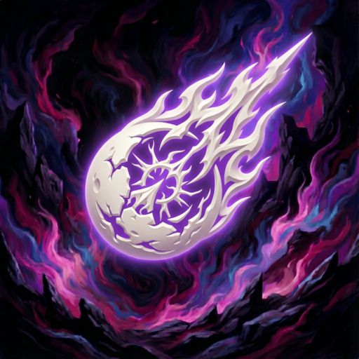

<p align="center">
  
</p>

<h1 align="center">XeldarAlz Dalamud Plugins</h1>

<p align="center">
  
  
  <a href="https://github.com/XeldarAlz/DalamudPlugins/commits/main"></a>
  <a href="LICENSE.md"></a>
</p>

<p align="center">
  <em>Custom Dalamud plugin repository by <a href="https://github.com/XeldarAlz">@XeldarAlz</a>.</em>
</p>

---

## What it is

A single Dalamud plugin repository that aggregates every plugin I publish. Add the URL once in XIVLauncher and each plugin below appears in `/xlplugins`, auto-updating whenever its source repo cuts a release. `repo.json` is regenerated by GitHub Actions on every plugin release and every 6 hours as a safety net.

## Install

In-game: `/xlsettings` → **Experimental** → paste into **Custom Plugin Repositories**:

```
https://raw.githubusercontent.com/XeldarAlz/DalamudPlugins/main/repo.json
```

Tick **Enabled**, click **+**, then **Save and Close**. Open `/xlplugins` → **All Plugins** and search for any of the plugins below.

## Plugins

| Plugin | Description | Source |
|---|---|---|
|  &nbsp; **Auto PVP LB** | Your PvP Limit Break, fired for you. | [FFXIV-AutoPVPLimitBreak](https://github.com/XeldarAlz/FFXIV-AutoPVPLimitBreak) |
|  &nbsp; **Auto Daily Tribes** | Daily allied tribe quests, done for you. | [FFXIV-AutoDailyTribes](https://github.com/XeldarAlz/FFXIV-AutoDailyTribes) |
|  &nbsp; **Auto Doman Mahjong** | Doman Mahjong, solved for you. | [FFXIV-AutoDomanMahjong](https://github.com/XeldarAlz/FFXIV-DomanMahjongSolver) |
|  &nbsp; **Auto FATE Grind** | Shared FATEs, farmed for you. | [FFXIV-AutoFATEGrind](https://github.com/XeldarAlz/FFXIV-AutoFATEGrind) |

## License

AGPL-3.0-or-later. Individual plugins are licensed under their own source repositories.
